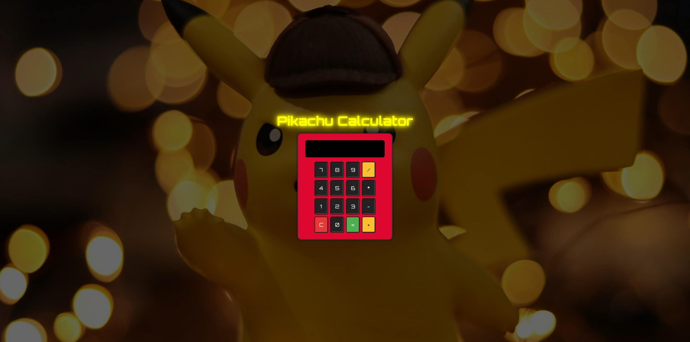
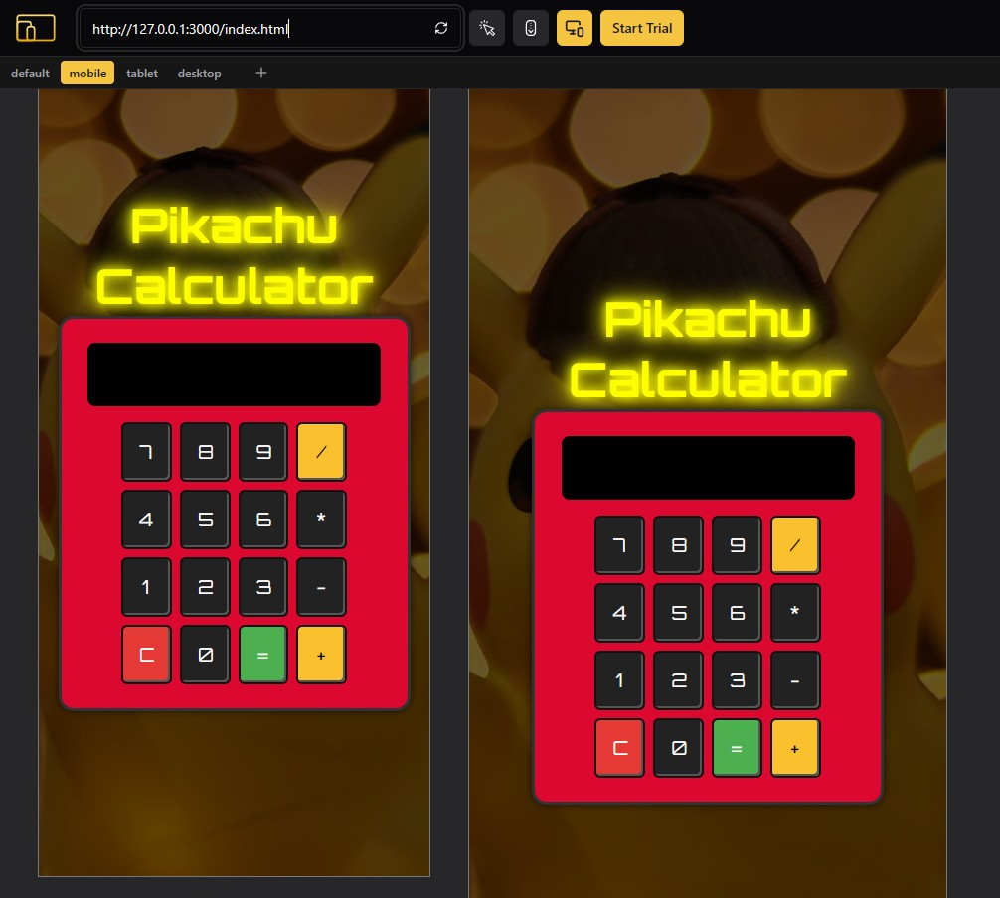

Pikachu Calculator es una aplicación web de calculadora desarrollada con HTML, CSS y JavaScript. En este proyecto presento una interfaz inspirada en el universo Pokémon, integrando animaciones fluidas y efectos de sonido para una experiencia interactiva y entretenida. Con un diseño responsivo y moderno, la calculadora ejecuta operaciones aritméticas básicas y demuestra el uso de buenas prácticas en la separación de lógica, estilo y contenido.

